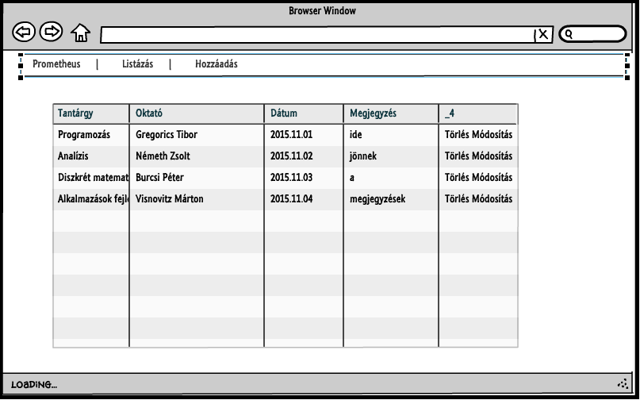

# Beadandó
###Beadandó az Alkalmazások fejlesztése c. tárgyhoz
###Kardos Attila
######U6L05S
======
##Követelményanalízis
======
A feladat egy Neptunhoz hasonló alkalmazás fejlesztése, mely segítségével a hallgatók bejelentkezés után fel tudják venni maguknak a tárgyakat.
A tantárgyak listája adott, csak az adatbázisban szereplő tárgyakat tudja felvenni a hallgató.
A tárgy kiválasztása után gyakorlatvezetőt is választani kell, szintén a megadott listából. 

======
##Tervezés
======
####Oldaltérkép
- Főoldal
  - Bejelentkezés
  - Regisztráció

- Főoldal (bejelentkezve)
  - Lista megtekintése
  - Új tárgy felvétele
  - Információ az alkalmazásról
  - Kijelentkezés

======

- Felhasználóifelület-modell

======

======

- Osztálymodell

======

======

-Végpontok

======

======
##Implementáció
======
Az alkalmazás a Cloud9 felületen, node.js eszközzel lett megvalósítva.
MVC mintát követ: (Mappaszerkezet)

- models
  - modellek 
- views
  - mappákban az egyes controllerek nézetei
- public
  - kliens oldalhoz szükséges stylus lapok/scriptek

======
##Tesztelés
======

======
##Felhasználói dokumentáció
======
A böngészőben megnyíló alkalmazásban információkat találunk magáról az
alkalmazaásról, hogy mire is jó, mi a célja. Bejelentkezés, illetve regisztráció
nélkül nem tudjuk igénybevenni az alkalmazás funcióit, csupán olvashatunk róla.
A regisztráció egyszerű,pár lépésben elvégezhető folyamat, a nevünk,neptun kódunk,
és jelszavunk megadása után be is jelentkezhetünk, és használhatjuk az alkalmazást.
A Hozzáadás gombra kattintva, amely a menüben található,kiválaszthatunk adott
listából különböző tantárgyakat. Miután a kiválasztás megtörtént,elérhetőek
lesznek a gyakorlatvezetők névsora egy hasonló listában. A listában csak azok
a gyakorlatvezetők jelennek meg, akik az adott tárgyat oktatják. Utána meg kell
adnunk a felvétel dátumát. Megjegyzést is írhatunk a végén, mely bármit
tartalmazhat, de nem kötelező írni.